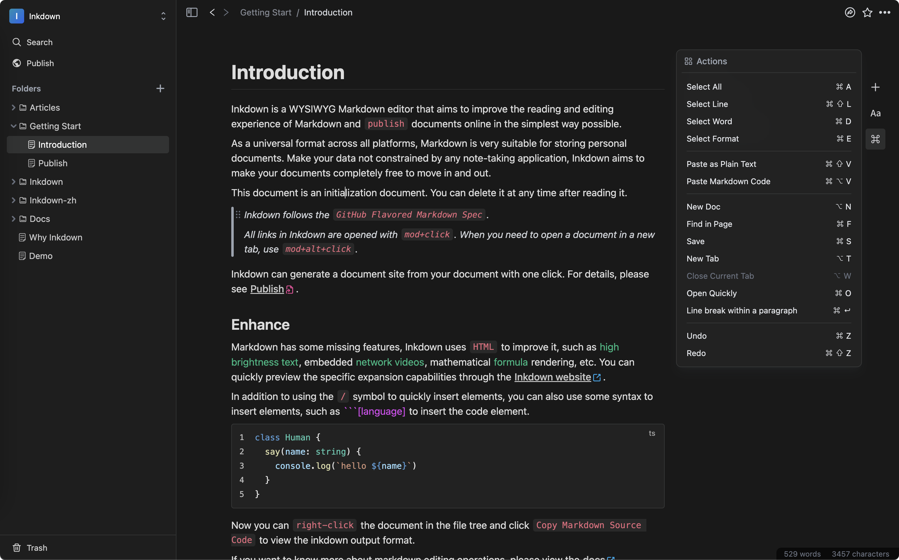

现代云笔记已经十分强大，可仍然还有很多用户选择Markdown编辑器，这是为什么呢？

- 无论您的网络环境如何，单机软件都可以正常使用，0延迟的畅快感是网络编辑器很难做到的。
- Markdown作为通用格式，它可以永远存储在你的电脑中，让个人数据不会绑定在任何一家公司上。

当然还有很多小优点，相信Markdown的使用者已经非常清楚。

可是Markdown并不完美，有很多Markdown编辑器使用了源码模式，或者双栏模式。带来的问题是一旦文章内容增长，多余的符号会非常影响阅读，对于查阅内容带来了严重的干扰。在很多场景下Markdown源码模式也并不利于书写，例如：Table，文字高亮需要借助html标签，他们的编辑都十分繁琐。

通常单机软件不具备网络功能，多端同步数据的时候我们需要借助第三方工具，比如icloud等，当我们希望将文档内容共享给其他阅读者时也只能借助第三方平台。

所以Inkdown的目标是什么？

- 响应迅速：和单机软件一样，没有任何延迟感，甚至可以离线使用。
- 使用所见即所得的模式来编辑，隐藏掉Markdown的符号，提升Table等组件的
- 以标准的Markdown存储：虽然Inkdown是网络编辑器，但借助现代浏览器文件系统，可以像单机软件那样实时以标准的Markdown格式同步至本机电脑中。
- 随时将Markdown文档迁入：Inkdown可以一键导入文件夹中的Markdown文档，文档的迁入与迁出没有任何使用成本。
- 内置数据同步：无论何时，只需打开浏览器，即可编辑内容，Inkdown带来闪电般的数据同步速度，和强大的web编辑器体验。
- 美观的界面：对于每日记录的工具，Inkdown希望保留简洁耐看的界面，不希望有太多的干扰元素。
- 一键发布：不只是分享您的某一篇文档，通过文件夹与文档之间的链接跳转，可以一键生成文档站点，对于系统性的知识内容分享十分友好。

总的来说，Inkdown希望保留现有单机Markdown笔记的优势，同时加入网络功能和所见即所得的编辑模式，让他的观感与使用体验都更加现代化。

Inkdown在编辑细节进行了许多优化, 如果您感兴趣，可以查看编辑体验优化。