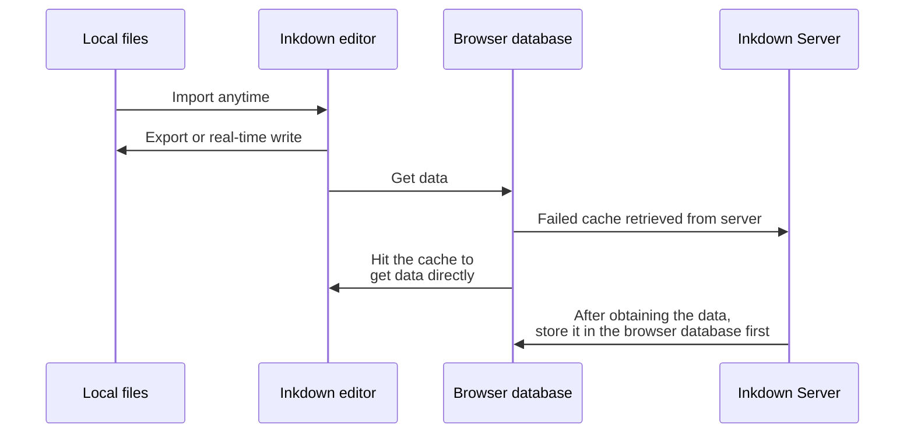

Inkdown is a WYSIWYG Markdown editor that aims to improve the reading and editing experience of Markdown and `publish` documents online in the simplest way possible.

As a universal format across all platforms, Markdown is very suitable for storing personal documents. Make your data not constrained by any note-taking application, Inkdown aims to make your documents completely free to move in and out.

This document is an initialization document. You can delete it at any time after reading it.

> Inkdown follows the `GitHub Flavored Markdown Spec`.
> 
> All links in Inkdown are opened with `mod+click`. When you need to open a document in a new tab, use `mod+alt+click`.

Inkdown can generate a document site from your document with one click. For details, please see [Publish](Publish.md).

## Enhance

Markdown has some missing features, Inkdown uses `HTML` to improve it, such as <span style="color:rgba(16,185,129,1)">high brightness text</span></span><span style="color:rgba(16,185,129,1)">, embedded </span><span style="color:rgba(16,185,129,1)">network videos</span></span><span style="color:rgba(16,185,129,1)">, mathematical </span><span style="color:rgba(16,185,129,1)">formula</span></span><span style="color:rgba(16,185,129,1)"> rendering, etc. You can quickly preview the specific expansion capabilities through the </span>[Inkdown website](https://www.inkdown.me#markdown)<span style="color:rgba(16,185,129,1)">.</span>

In addition to using the `/` symbol to quickly insert elements, you can also use some syntax to insert elements, such as <span style="color:rgba(217,70,239,1)">```[language]</span></span><span style="color:rgba(217,70,239,1)"> to insert the code element.</span>

```ts
class Human {
  say(name: string) {
    console.log(`hello ${name}`)
  }
}
```

Now you can `right-click` the document in the file tree and click `Copy Markdown Source Code` to view the inkdown output format.

If you want to know more about markdown editing operations, please view the [docs](https://pb.inkdown.me/inkdown/book/docs/markdown).

## File Conversion

Inkdown chooses Markdown files as its host because it is the most common document format currently and is supported by almost all mainstream platforms. This allows you to import existing documents into Inkdown with one click, or you can migrate your documents out at any time, depending on your usage habits. Inkdown hopes to retain the characteristics of stand-alone software that runs quickly and stores files locally, while adding the ability to synchronize data and publish documents.

Inkdown uses the browser's file system to batch import or export local Markdown files. During the conversion process, Inkdown will automatically handle dependencies with attachments such as images and change their reference paths to relative paths. You can also bind the `workspace` to a local folder, and Inkdown will synchronize the document content to the folder in<span style="color:rgba(16,185,129,1)"> real time</span></span><span style="color:rgba(16,185,129,1)"> using standard Markdown.</span>

Inkdown's data conversion process is as follows:



Because the data is cached by the browser database, Inkdown does not feel any delay during the editing process. Just like stand-alone software, Inkdown uses `PWA` technology, which allows Inkdown to be installed on the desktop and even run `offline`. When your network is restored, Inkdown will automatically synchronize the document content.

If you use the [web version](https://app.inkdown.me), you can install inkdown to your desktop through your browser.It will be basically the same as the desktop application experience.


As shown below

