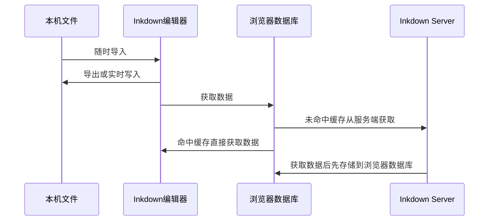

Inkdown选择以Markdown文件作为宿主，这是因为它是目前最通用的文档格式，几乎受到所有主流平台的支持。这可以使得您将现有文档一键导入Inkdown，也可以随时将您的文档迁出，这取决于您的使用习惯。

> Inkdown follows the `GitHub Flavored Markdown Spec`.

Inkdown使用浏览器的文件系统来进行批量导入或导出本机Markdown文件，在转换过程中Inkdown将自动处理与图片等附件的依赖关系，并将他们的引用路径变更为相对路径。也可以将工作区与本机文件夹绑定，Inkdown将实时以标准的Markdown将文档内容同步至该文件夹。

Inkdown的转换流程如下：

因为数据由浏览器数据库作为缓存，所以Inkdown在编辑过程中感受不到任何延迟，就像单机软件一样，Inkdown使用了`PWA`技术，这可以让Inkdown安装在桌面，甚至可以离线运行，当您的网络恢复时，Inkdown将自动同步文档内容。

当您将Inkdown Web App 安装至桌面时他的效果如下所示：