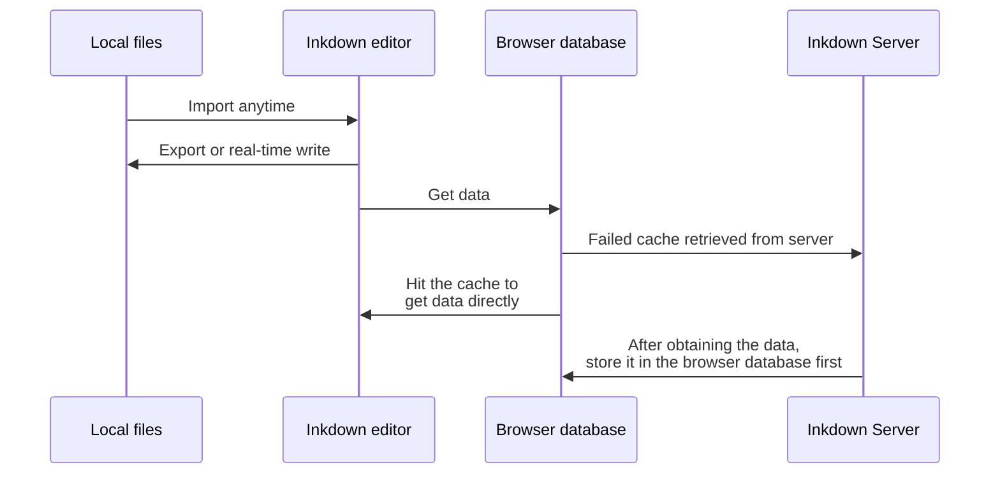
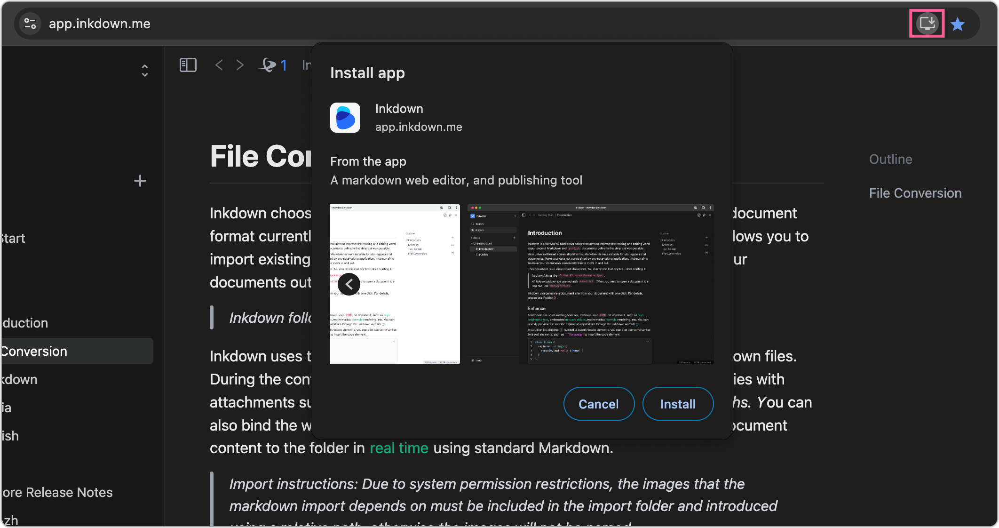
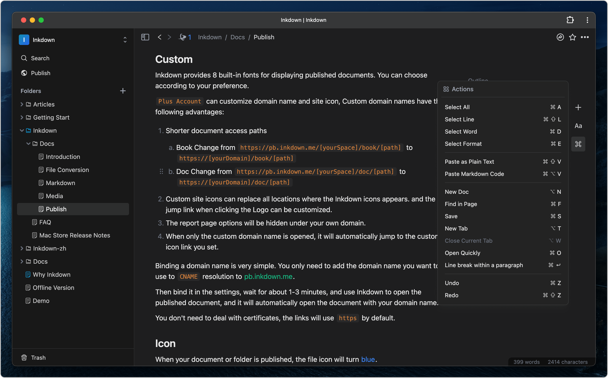

Inkdown chooses Markdown files as its host because it is the most common document format currently and is supported by almost all mainstream platforms. This allows you to import existing documents into Inkdown with one click, or you can migrate your documents out at any time, depending on your usage habits.

Inkdown uses the browser's file system to batch import or export local Markdown files. During the conversion process, Inkdown will automatically handle dependencies with attachments such as images and change their reference paths to relative pat*hs. Y*ou can also bind the workspace to a local folder, and Inkdown will synchronize the document content to the folder in real time using standard Markdown.

> Import instructions: Due to system permission restrictions, the images that the markdown import depends on must be included in the import folder and introduced using a relative path, otherwise the images will not be parsed.

Inkdown's data conversion process is as follows:

Because the data is cached by the browser database, Inkdown does not feel any delay during the editing process. Just like `stand-alone` software, Inkdown uses `PWA` technology, which allows Inkdown to be installed on the desktop and even run offline. When your network is restored, Inkdown will automatically synchronize the document content.

If you use the [web version](https://app.inkdown.me), you can install inkdown to your desktop through your browser.It will be basically the same as the desktop application experience.

As shown below

