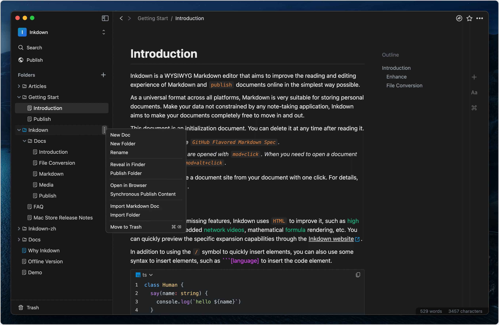

Inkdown is a WYSIWYG Markdown editor that aims to improve the reading and editing experience of Markdown and `publish` documents online in the simplest way possible.

As a cross-platform universal format, `Markdown` is very suitable for saving personal documents. The built-in file system of Inkdown allows you to migrate in and out at any time. Enhanced based on Markdown writing habits to make it smoother.

***

## Main functions

- **File conversion:** Inkdown uses the browser file system to batch import or export native Markdown files at any time. During the conversion process, it will automatically handle problems such as path dependencies on images. For details, please see [File Conversion](File%20Conversion.md).
- **Enhance:** Markdown has some missing features, Inkdown uses `HTML` to improve it, such as high brightness text, embedded network videos, mathematical formula rendering, etc. You can quickly preview the specific expansion capabilities through the [Inkdown website](https://www.inkdown.me#markdown).
- **Publish:** You can publish your documents to the internet at any time, or you can easily organize folders into knowledge sites with just one click. If you want to experience publishing immediately, please refer to the [Publish](Publish.md).
- **Fast:** Inkdown uses a browser database to cache content, and there is no any delay during the editing process. It has been improved based on Markdown editing habits, resulting in a very smooth editing experience.