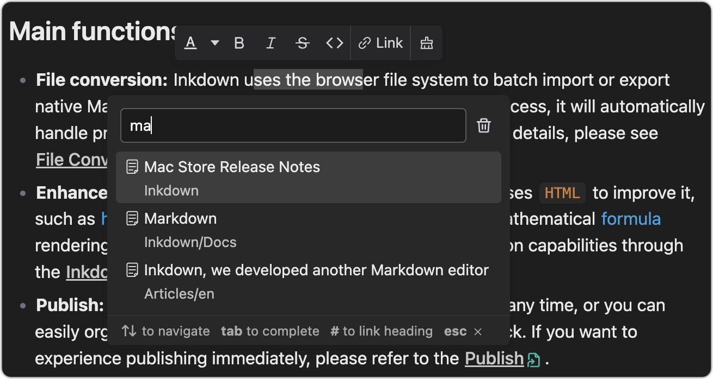
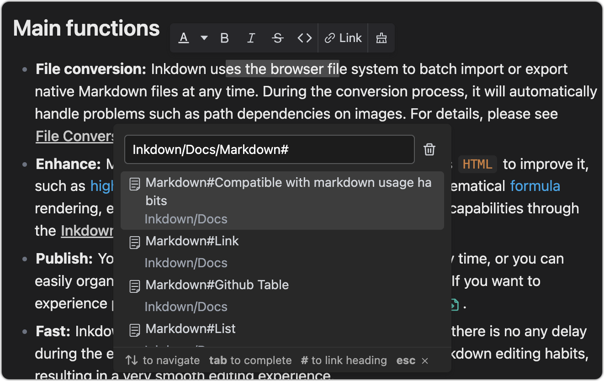
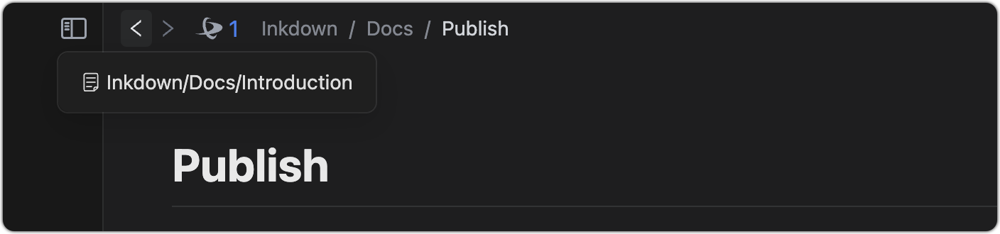
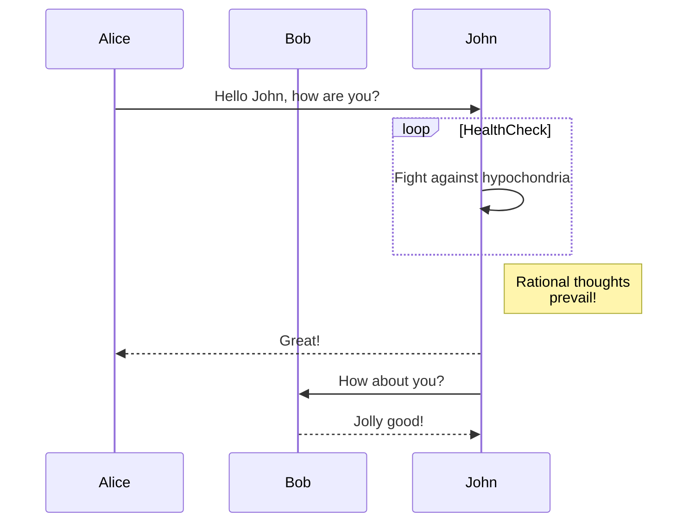

This document assumes that you have a basic understanding of Markdown. The following is an introduction to common editing operations for Inkdown. You can use shortcut keys or enter `/`symbols at the beginning of a paragraph to insert elements. More shortcuts can be found in the menu on the right.

> Inkdown follows the `GitHub Flavored Markdown Spec`, This article provides a brief introduction to some commonly used operations.

## Link

You can use the link options in the floating bar to add links to text, which can be other markdown files in the space or protocol addresses such as HTTP. As shown in the following image:

> Inkdown uses relative paths to save file links in the source markdown file.



You can also use `tab` to complete the file path and add a `#` to link to the anchor of the markdown file



If you want to quickly reference other documents in the workspace, you can type `@` to quickly insert a document link.

Use `mod+click` to open the link. If it is a file path, you can also use `mod+alt+click` to open the link with a new tab page.

If there are other files that reference an open document, the referenced tag will be displayed in the navigation bar.



## Github Table

After creating the table, use `mod+shift+enter` to create a new row, and use `mod+shif+backspace` to delete the current row.

> Use `tab` to switch to the next table cell, `shift+tab` to return to the previous table cell.
> 
> In the table, use `mod+a` to select all table cells, and press `backspace` twice to delete the table.
> 
> The table more shortcut keys can be found in the context menu

| Name | Area     | Balance |
| ---- | -------- | ------- |
| jack | New York | $1600   |
| joe  | London   | $128    |
| zoe  | Shanghai | $523    |

## List

Typing `1` or `-` with spaces at the beginning of a paragraph can convert it to an ordered or unordered list. Adding`[ ]`and spaces at the beginning of a paragraph can convert them into a task list, or use shortcut keys in the system menu to control them.

1. List item1
2. List item2
3. List item3

   1. Nested Item1
   2. Nested Item2

      ```ts
      const text = 'This is the nested content of list items'
      ```

   3. Nested Items3


- [x] Todo1
- [ ] Todo2

List items can be nested with content. Use `mod+enter` to insert new elements into the list items, and use `tab` or `shift+tab` to indent or undo the list.

## Front Matter

Enter the `---` symbol at the beginning of the document and press Enter to insert the `Front matter` element. Inkdown will only display the Front matter without any special processing.

## Code fences

Enter the following content at the beginning of the paragraph and add a enter to create a code fence

````
```[language]
````

At the end of the code fence, use `mod+enter` to jump out of the code snippet or use the up and down arrow keys.

> Note: When using `mod+a` in a code fence, the code in the fence will be selected instead of the entire document. When the code fence content is empty, use `backspace` to directly delete the element

```ts
class Human {
	public say() { 
    console.log('hello world')
	}
}
```

```go
package main

import "fmt"

func main() {
    fmt.Println("Hello, World!")
}
```

```swift
import Cocoa
struct MarksStruct {
    var mark: Int
    init(mark: Int) {
      self.mark = mark
    }
}
var aStruct = MarksStruct(mark: 98)
print(aStruct.mark)
```

## Mermaid

Mermaid is a tool that uses syntax to render graphics. When you create a code fence for the Mermaid language, the Mermaid graphics will be automatically rendered below the code snippet for [more details](https://mermaid.js.org/).

When the cursor leaves the input area, the code fence will be automatically collapsed, and the rendering effect is as follows:



## Formula

Type`$$`at the beginning of the pfaragraph to create a block level formula editing area, where the formula will automatically render below. When the cursor leaves the editing area, it will be automatically folded. The rendering effect is as follows:

$$
\int_{-\infty}^{+\infty} e^{-x^2} dx = \sqrt{\pi}
$$

In line formula:$\int_{-\infty}^{+\infty} e^{-x^2} dx = \sqrt{\pi}$