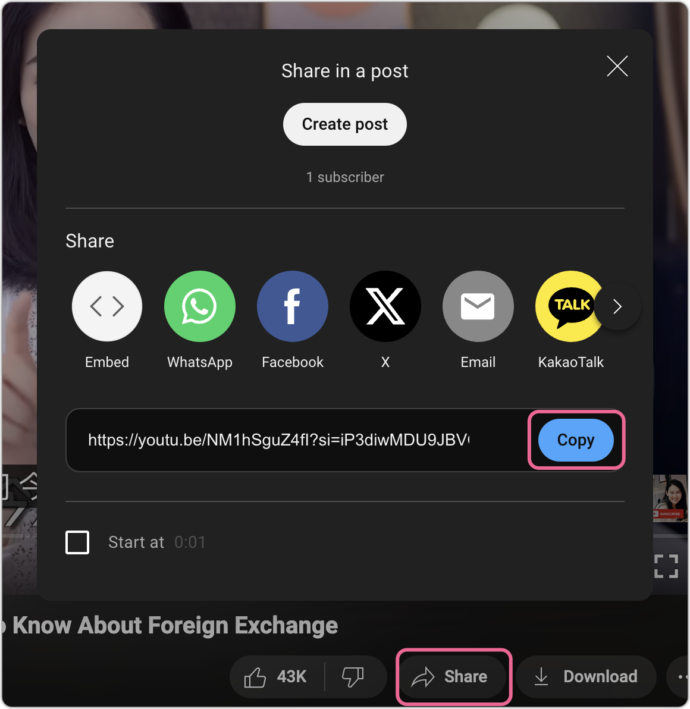
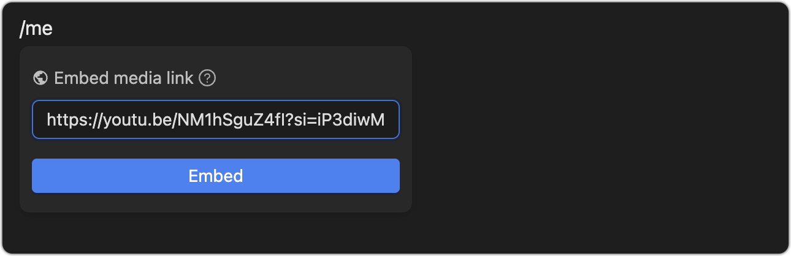

You can insert local or network images, or use `Media Link` to insert network media. When selecting media, there is a slider below the element to adjust the element size. When double clicking on the image, it will restore the default height.

Media link also supports embedding in web pages. It should be noted that some network resources are prohibited from being referenced by third parties.


## Other media

> Website content or non-image and video media will be stored in the form of iframes, such as `youtube`

```mdx
## YouTube

<iframe src="https://www.youtube.com/embed/HTvJl71zmf4?si=G5VBrJm3yr0XR" height="394"/>
```

<iframe src="https://www.youtube.com/embed/HTvJl71zmf4?si=G5VBrJm3yr0XR" alt="" height="394"/>

## Embed Youtube Video

You can embed any Youtube video, but please note that `Youtube` is not currently supported embedding `HDR` ultra-definition videos. The uåsage process is as follows:

Open Youtube and select any video, click Share, and copy the link



In the Inkdown editor, Use Media Link to paste the link into it

