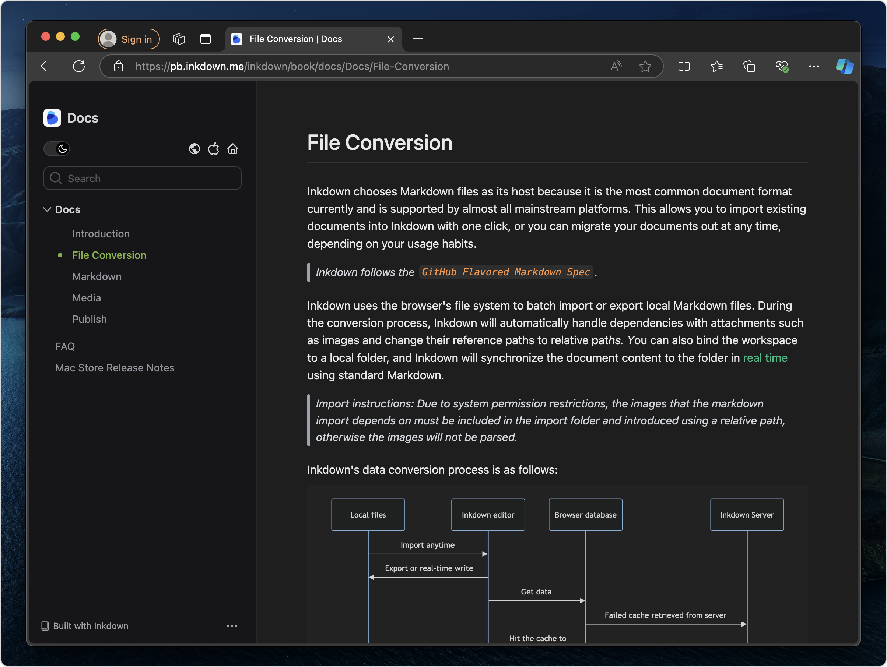
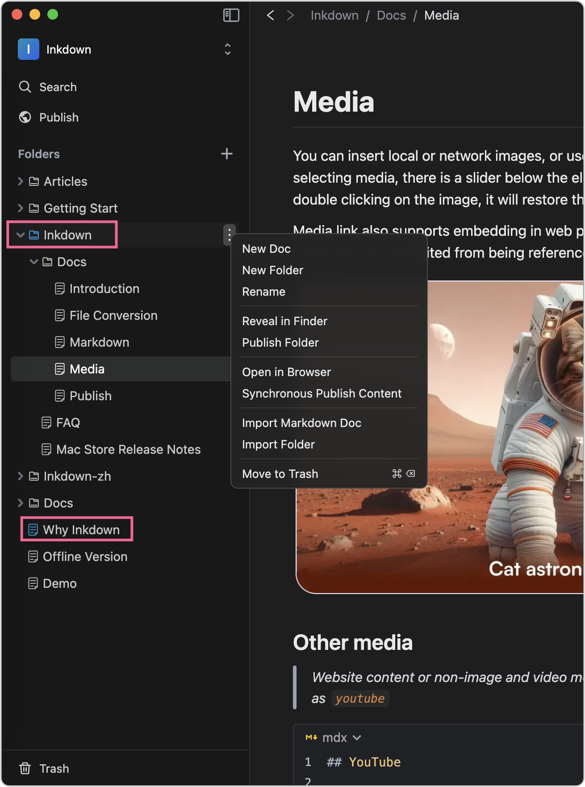

You can publish a single document or folder to the Internet with one click. Folders can form a series of documents into a document station, which is very friendly for publishing small e-books, like this document.

Each folder can generate a document station with one click, and Plus accounts can create `unlimited` document sites.

To isolate notes from published content, When your document changes, you need to click the `update` button to update the published document. This prevents readers from seeing incomplete content when the document is not edited.

Documents published using Inkdown are responsive and can be displayed well on any device and screen size.

> When publishing a folder, the document structure should be consistent with the folder structure. Inkdown uses `ssr` rendering to ensure that the document opens extremely quickly.

Now let's directly publish the Inkdown introduction document to the internet. You can right-click on the `Getting Start` folder on the left and click on `Publish Folder`

It looks like the images below

## Custom

Inkdown provides <b>8</b> built-in fonts for displaying published documents. You can choose according to your preference.

`Plus Account` can customize domain name and site icon, Custom domain names have the following advantages:

1. Shorter document access paths

   1. Book Change from `https://pb.inkdown.me/[yourSpace]/book/[path]` to  `https://[yourDomain]/book/[path]`
   2. Doc Change from `https://pb.inkdown.me/[yourSpace]/doc/[path]` to  `https://[yourDomain]/doc/[path]`

2. Custom site icons can replace all locations where the Inkdown icons appears. and the jump link when clicking the Logo can be customized.
3. The report page options will be hidden under your own domain.
4. When only the custom domain name is opened, it will automatically jump to the custom icon link you set.

Binding a domain name is very simple. You only need to add the domain name you want to use to `CNAME` resolution to pb.inkdown.me.

Then bind it in the settings, wait for about 1-3 minutes, and use Inkdown to open the published document, and it will automatically open the document with your domain name.

You don't need to deal with certificates, the links will use `https` by default.

## Icon

When your document or folder is published, the file icon will turn blue.

Now when you use the context menu, there will be two more options： `Open in Browser` `Synchronous Publish Content`. Whenever the content changes, you need to re-sync the published document.